# RPG Maker to Android APK Guide

A comprehensive guide and Android Studio template for converting RPG Maker MV and MZ games into Android APKs.

## 🛠️ Prerequisites
Before starting, ensure you have the following:
- A computer with **Windows, macOS, or Linux**.
- **Android Studio** installed.
- An RPG Maker **MV or MZ** game ready for deployment.

## 📌 Installation & Setup

### 1️⃣ Install and Set Up Android Studio
---
1. Download the latest version of Android Studio from [here](https://developer.android.com/studio).
   
   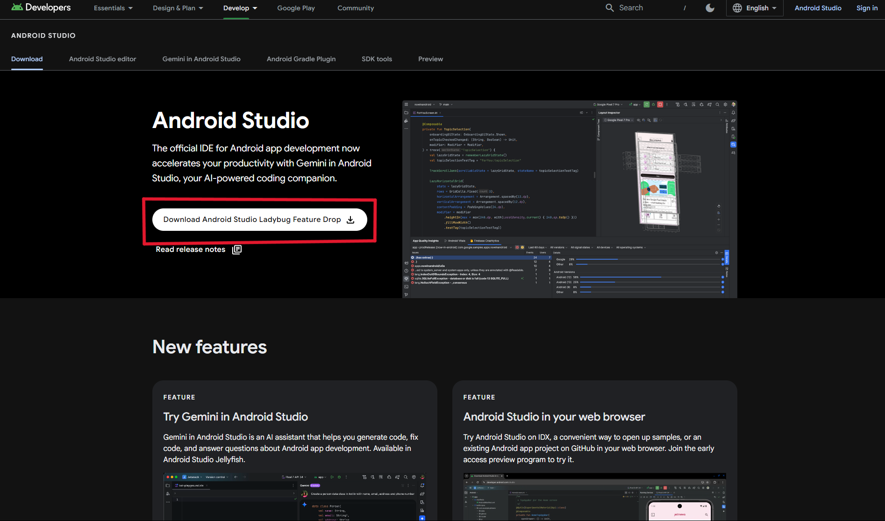
   
3. Install it and follow the setup wizard (default settings are recommended).

### 2️⃣ Download and Extract the Template
---
1. Get the template from the **latest release** or [download it here](https://github.com/Reishandy/RPG-Maker-to-Android/releases/download/project-fles/RPG-Maker-to-Android-project.zip).
2. Extract the downloaded `.zip` file.
   
   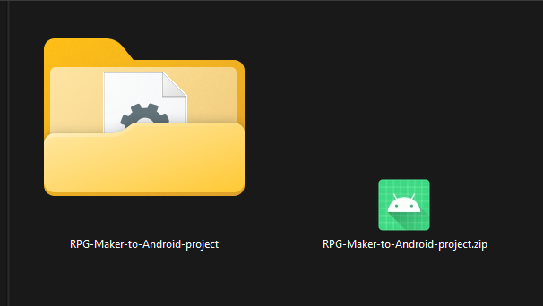

### 3️⃣ Deploy Your Game from RPG Maker
---
- **MV:** Choose `Web Browser` as the deployment platform.
  
  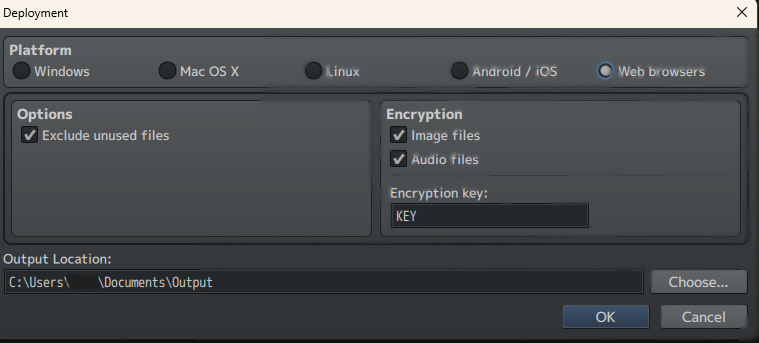
  
- **MZ:** Choose `Web Browser / Android / iOS`.
  
  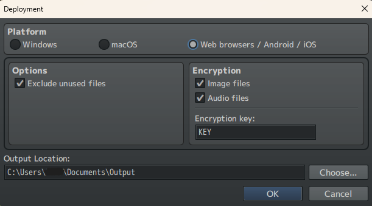

### 4️⃣ Place Game Files in the Android Project
---
1. Navigate to the extracted project folder.
2. Go to `RPG-Maker-to-Android-project/app/src/main/assets/www`.
3. Copy and paste the deployed game files into this folder. Ensure `index.html` is directly inside it and **not nested in another `www` folder**.
   
   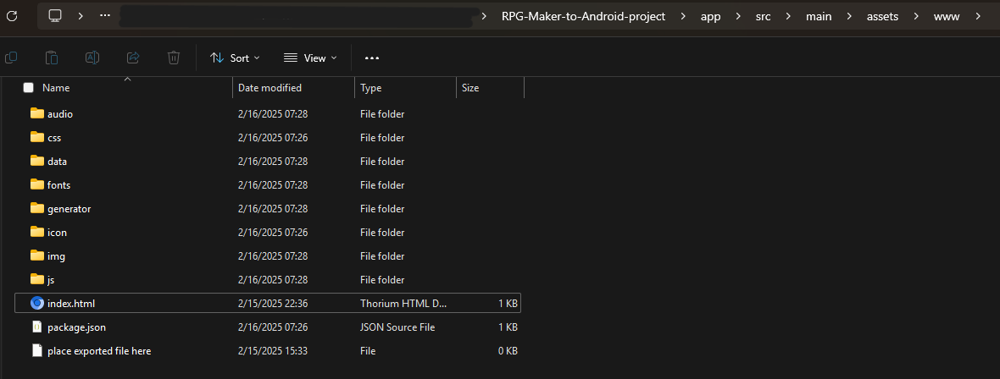

### 5️⃣ Open the Template in Android Studio
---
1. Open **Android Studio** and select `Open an existing project`.
2. Navigate to the extracted template folder and open it.
3. Click `Trust Project` if prompted.
   
   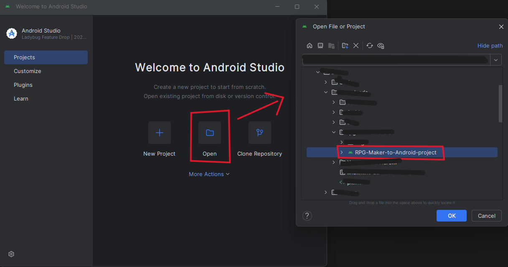
   
5. Wait for Gradle to sync (this may take a few minutes).
6. If you see an **Invalid Gradle JDK Configuration Found**, select the latest JDK installed on your system or download a new one.
   
   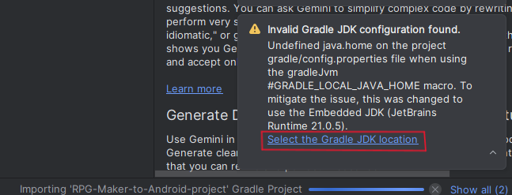

### 6️⃣ Change Package Name
---
1. Expand `app > kotlin/java`.
2. Right-click `com.rpgmakergame.rpgmakertemplate` > `Refactor` > `Rename` > `All Directories`.

   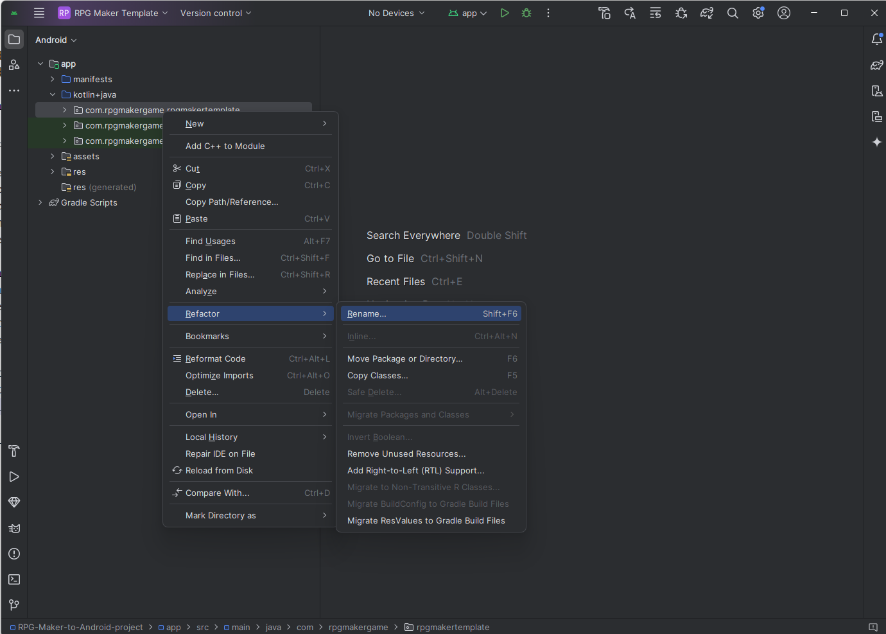

4. Enter your desired package name and confirm.

   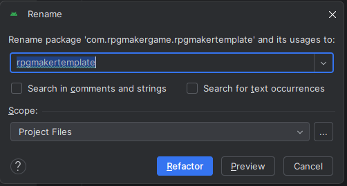

5. Also change the names in build.gradle.kts (Module)

   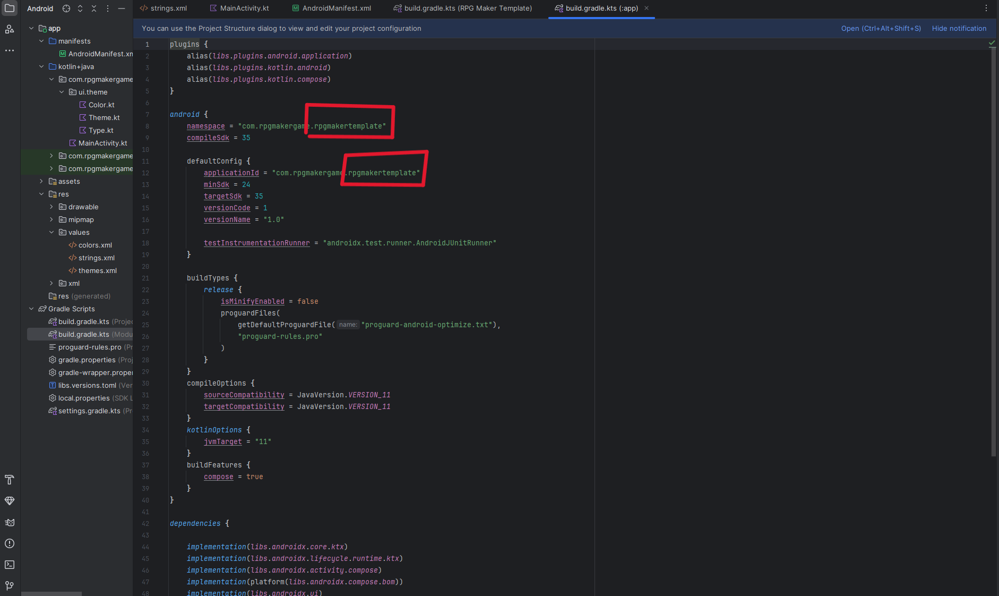

   then press sycn now at the blue ribbon

   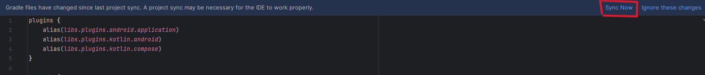

### 7️⃣ Customize App Name and Icon
---
#### **A. Change App Name**
1. Expand `res > values`.
2. Open `strings.xml`.
3. Edit the `app_name` value.
   
   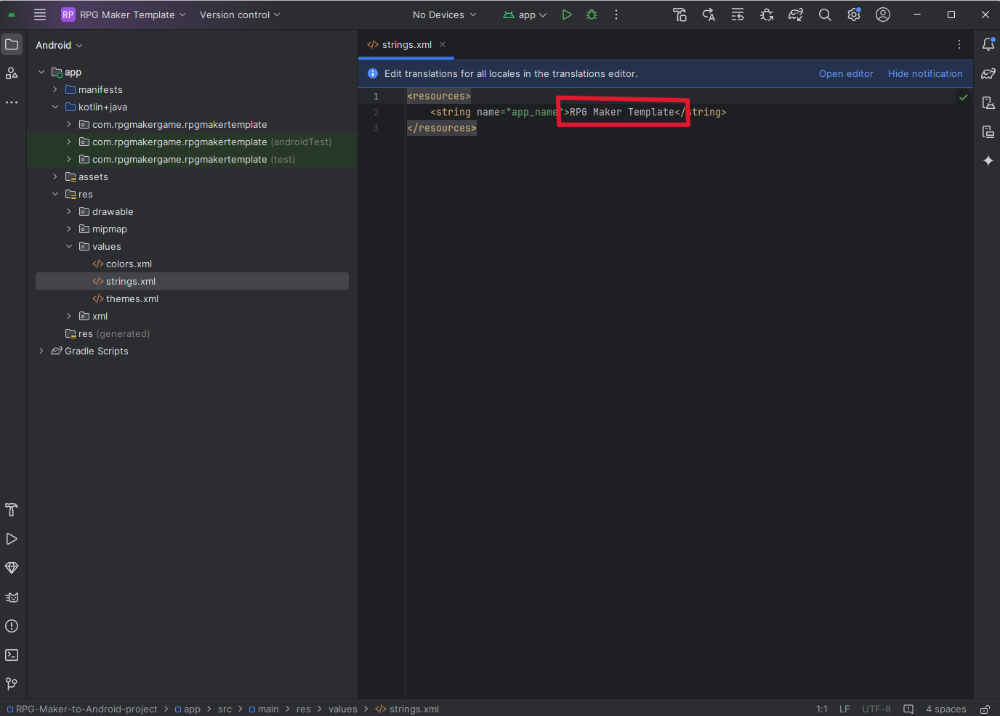

#### **B. Change App Icon**
---
1. Expand `res/`.
2. Right-click `mipmap` folder > `New` > `Image Asset`.
   
   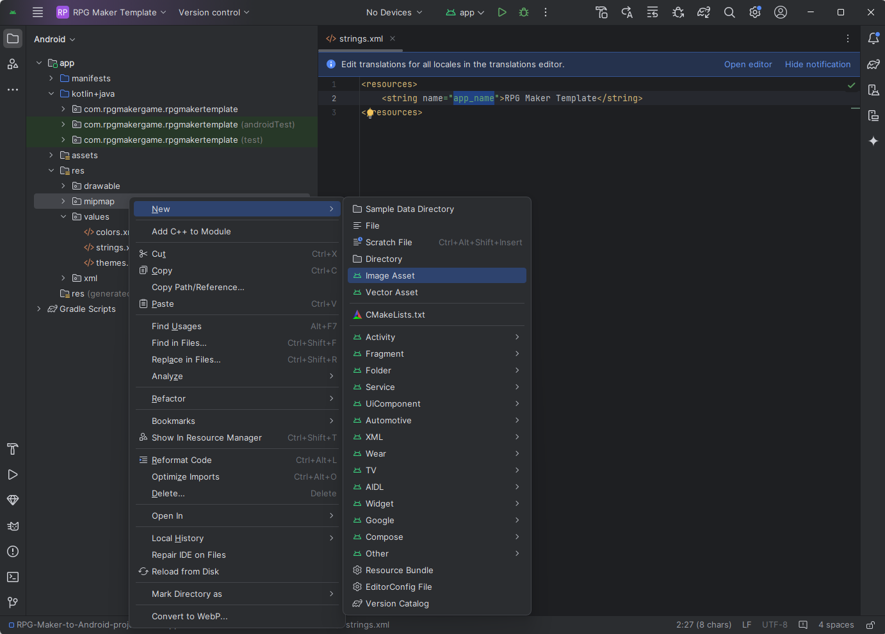
   
4. Customize the foreground and background images.
   
   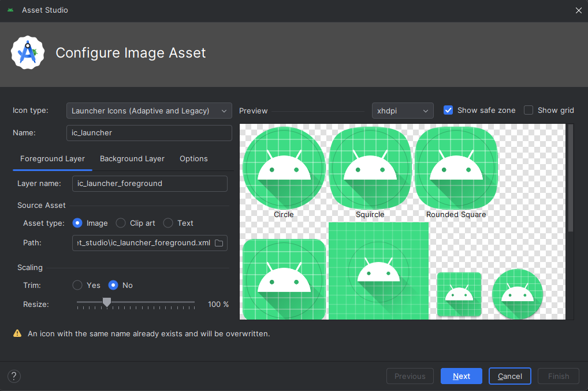
   
6. Click `Next` > `Finish`.

### 8️⃣ Generate Signed APK (for Distribution)
---
1. Open `Generate Signed Bundle / APK` from the Build menu.
   
   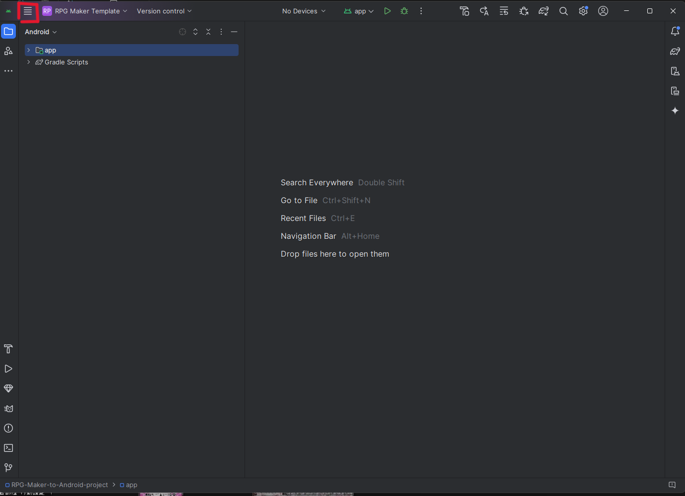

   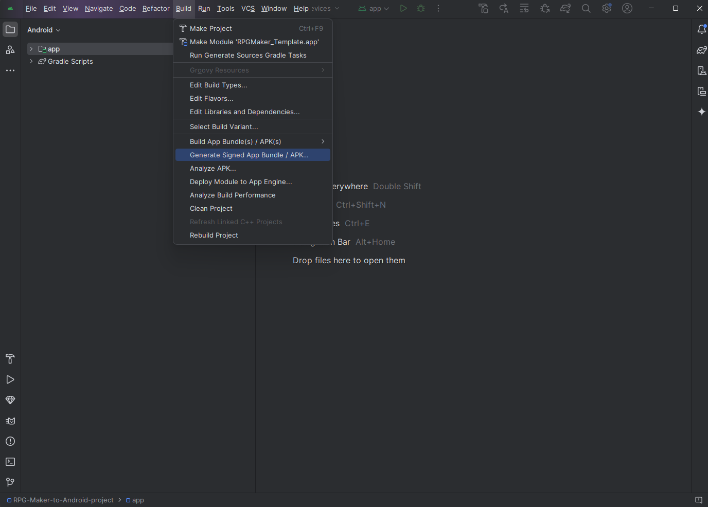
   
3. Select `APK` (or `Android App Bundle` if publishing to Google Play Store).
   
   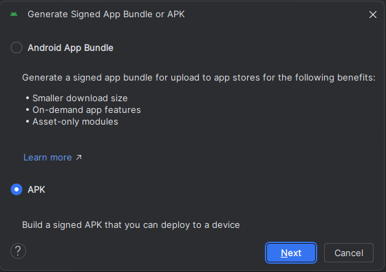
   
5. Create a new keystore:
   - Fill out the form with your keystore details.
     
   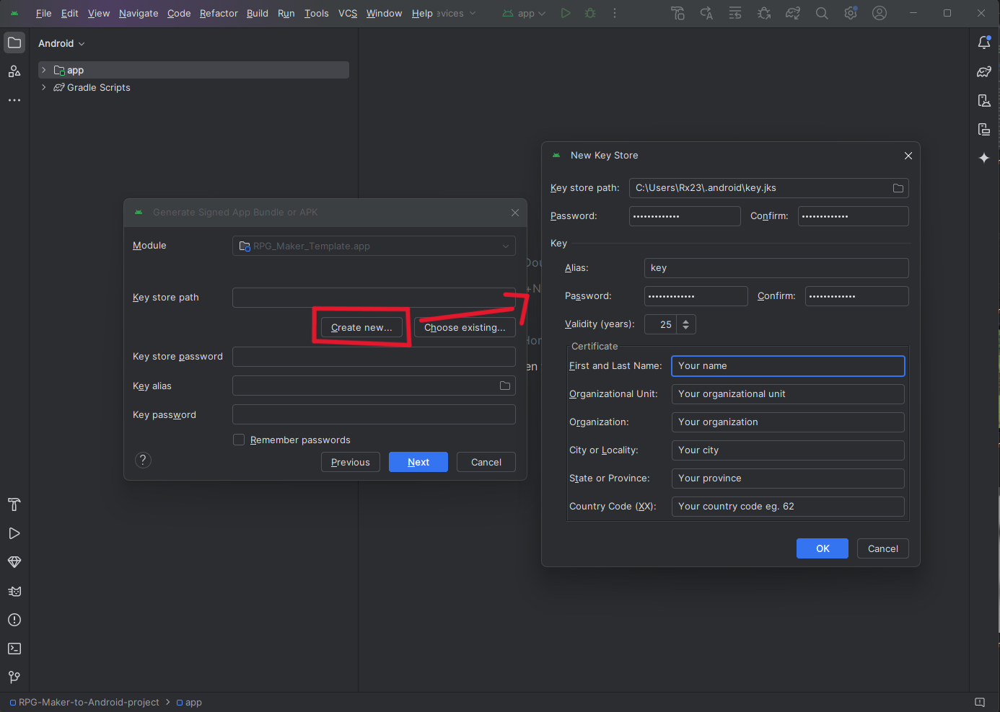
   
7. Click `Next`, select `Release`, and generate the APK.
   
   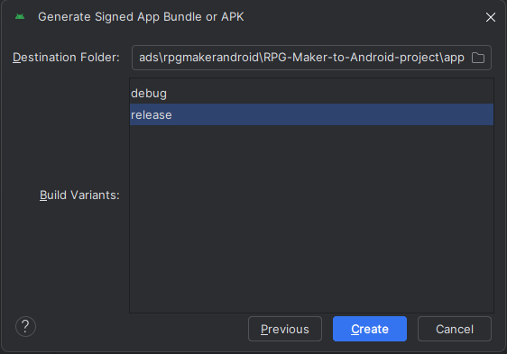
   
9. The APK will be available in `RPG-Maker-to-Android-project/app/release/`, or click `Locate` in the notification.
   
   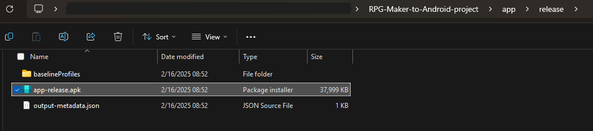

## 📢 Additional Notes
- If you want to **publish your game on the Play Store**, generate an **App Bundle** instead of an APK.
- If you experience **build errors**, check your **SDK and JDK versions** in Android Studio settings.
- For troubleshooting or additional customization, refer to the [official documentation](https://developer.android.com/studio).

## 📄 License

This project is licensed under the Apache 2.0 License - see the [LICENSE](LICENSE) file for details.

## 🙏 Credits

Created by [Reishandy](https://github.com/Reishandy)

## 🎮 Enjoy Making Your RPG Game on Android!
If this guide helped you, consider giving a ⭐ on [GitHub](https://github.com/Reishandy/RPG-Maker-to-Android)! 🚀
