# Panduan RPG Maker ke Android APK  
**Tutorial sederhana dan file Android Studio untuk mengonversi game RPG Maker MV dan MZ yang telah dideploy menjadi APK Android.**  

> 📄 **[Baca dalam Bahasa Inggris](./README.md)**  

## 📌 Pendahuluan  
Panduan ini menjelaskan langkah-langkah untuk mengubah game RPG Maker MV dan MZ yang telah dideploy menjadi APK Android menggunakan Android Studio. Dengan mengikuti tutorial ini, Anda dapat menjalankan game RPG Maker di perangkat Android dengan mudah.  

---

## 🚀 Langkah-Langkah  

### 1️⃣ Instal dan Siapkan Android Studio  
1. Unduh versi terbaru dari Android Studio:  
   🔗 [https://developer.android.com/studio](https://developer.android.com/studio)  
   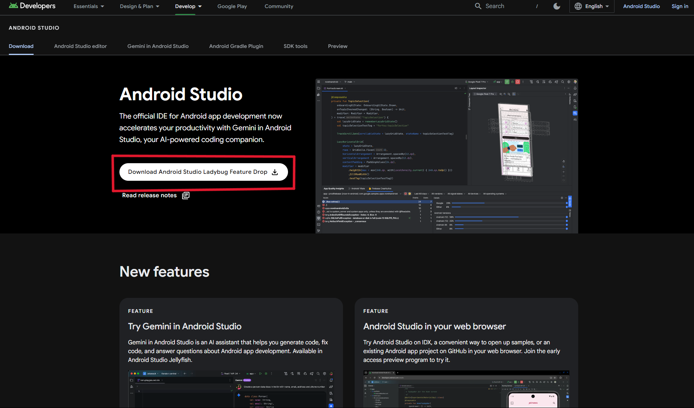  
2. Instal dan ikuti petunjuk wizard pengaturan (pilih opsi default).  

---

### 2️⃣ Unduh dan Ekstrak Template  
1. Unduh template dari rilis terbaru atau dari tautan berikut:  
   🔗 [RPG Maker to Android Template](https://github.com/Reishandy/RPG-Maker-to-Android/releases/download/project-fles/RPG-Maker-to-Android-project.zip)  
2. Ekstrak file zip yang telah diunduh.  
   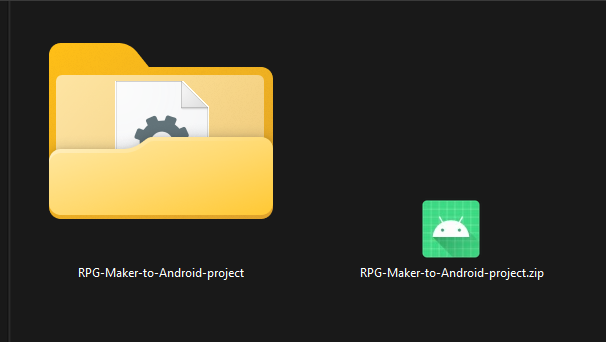  

---

### 3️⃣ Deploy Game dari RPG Maker  
1. **Untuk RPG Maker MV**, pilih opsi **Web Browser** saat melakukan deploy.  
   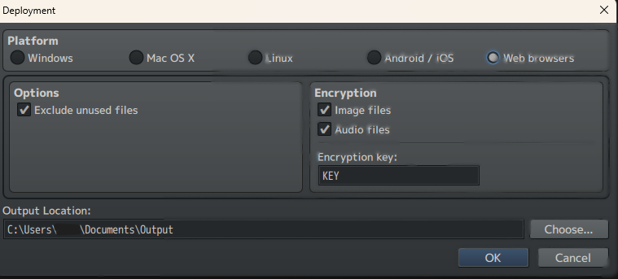  
2. **Untuk RPG Maker MZ**, pilih **Web Browser / Android / iOS**.  
   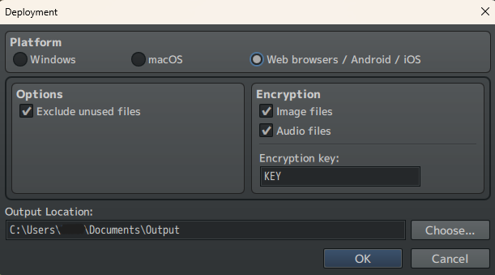  

---

### 4️⃣ Pindahkan File Game ke Folder `assets/www`  
1. Buka folder hasil ekstraksi.  
2. Navigasikan ke **`RPG-Maker-to-Android-project/app/src/main/assets/www`**.  
3. Pindahkan file hasil deploy ke folder ini. **Pastikan `index.html` ada di dalamnya dan tidak berada dalam folder lain seperti `www/www`**.  
   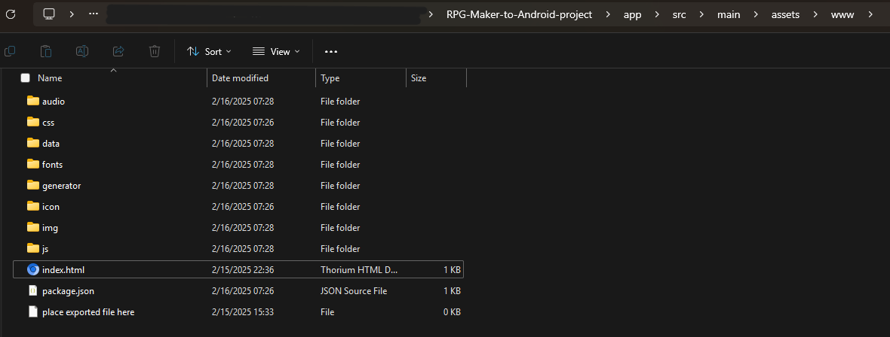  

---

### 5️⃣ Buka Template di Android Studio  
1. Jalankan **Android Studio** dan buka folder proyek yang telah diekstrak.  
2. Percayai proyek jika diminta.  
   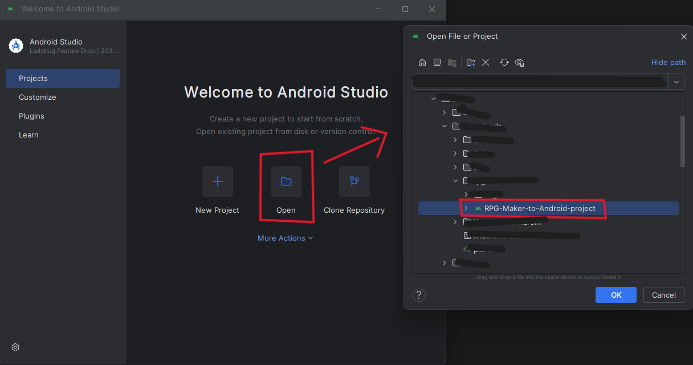  
3. Tunggu hingga proses Gradle selesai (bisa memakan beberapa menit).  
4. Jika muncul error **Invalid JDK**, ganti JDK dengan mengikuti petunjuk atau unduh versi terbaru.  
   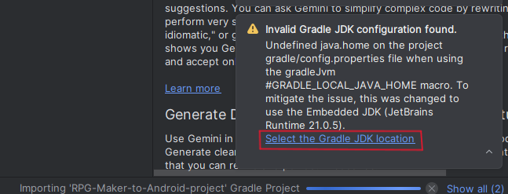  

---

### 6️⃣ Ubah Nama Paket Aplikasi  
1. Buka direktori **`app/kotlin+java`**.  
2. Klik kanan pada **`com.rpgmakergame.rpgmakertemplate`** → **Refactor** → **Rename** → **All Directories**.  
     
3. Beri nama baru sesuai keinginan, lalu klik **Refactor**.  
     

---

### 7️⃣ Ubah Nama Aplikasi & Ikon  
#### a️⃣ Ubah Nama Aplikasi  
1. Buka **`res/values/strings.xml`**.  
2. Ubah nilai **`app_name`** sesuai keinginan.  
   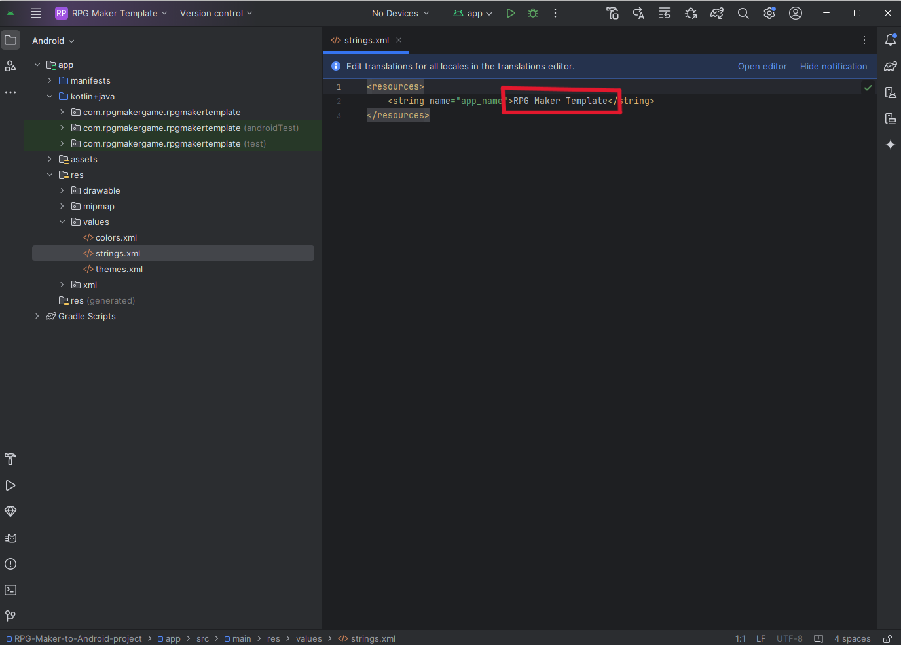  

#### b️⃣ Ubah Ikon Aplikasi  
1. Buka direktori **`res/`**.  
2. Klik kanan folder **`mipmap`** → **New** → **Image Asset**.  
     
3. Sesuaikan ikon dengan mengubah **Foreground** dan **Background Layer**.  
     
4. Klik **Next** → **Finish**.  

---

### 8️⃣ Buat APK dengan Tanda Tangan (Signed APK)  
1. Buka menu **Generate Signed App Bundle / APK**.  
   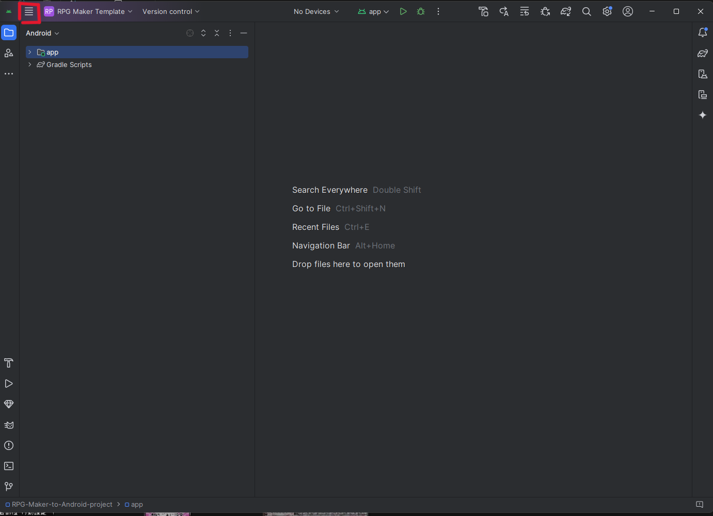  
     
2. Pilih **APK** (atau **Android App Bundle** jika ingin mengunggah ke Play Store).  
     
3. Buat kunci baru (**New Key**) dan isi formulir.  
     
4. Klik **Next** → pilih **Release** → klik **Create** dan tunggu proses selesai.  
   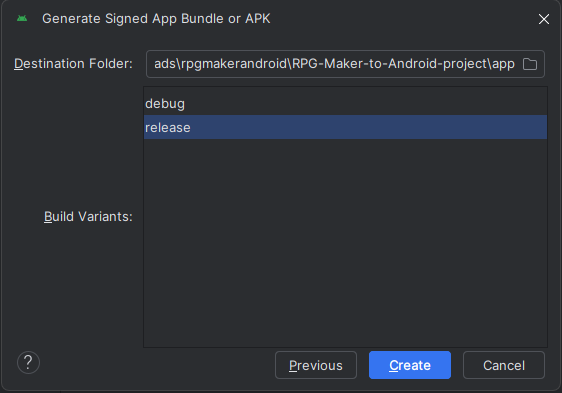  
5. APK yang telah dibuat dapat ditemukan di **`RPG-Maker-to-Android-project/app/release`**, atau tekan **Locate** pada notifikasi.  
   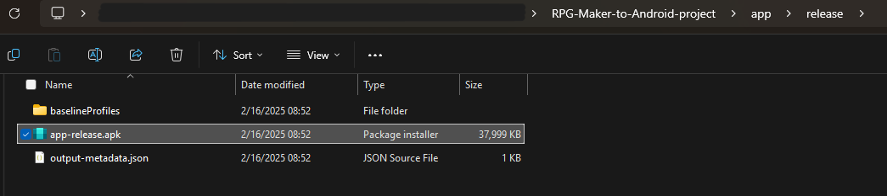  

---

## 🎉 Selesai!  
Sekarang, Anda telah berhasil mengonversi game RPG Maker MV/MZ menjadi APK Android! Anda dapat menginstalnya di perangkat Android atau membagikannya ke orang lain.  

Jika ada pertanyaan atau kendala, silakan lihat **[README versi Inggris](./README.md)** atau kunjungi halaman GitHub proyek ini. 🚀
